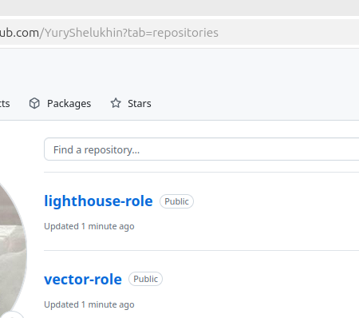
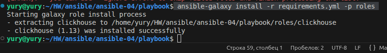

# Домашнее задание к занятию 4 «Работа с roles».Шелухин Юрий.

## Подготовка к выполнению

1. * Необязательно. Познакомьтесь с [LightHouse](https://youtu.be/ymlrNlaHzIY?t=929).

#
Интересный инстумент от Google, имеющий как преимущества, так и недостатки. На мой взгляд как инмтрумент мониторинга проигрывает Zabbix, Prometheus и др.

2. Создайте два пустых публичных репозитория в любом своём проекте: vector-role и lighthouse-role.

#


3. Добавьте публичную часть своего ключа к своему профилю на GitHub.

#


Запустим SSH-агент.
`eval "$(ssh-agent -s)"`
Добавим приватный ключ в агент.
`ssh-add /home/yury/HW/ansible/ansible-04/secrets/yandex-cloud-key`
Проверим, что ключ добавлен.
`ssh-add -l`
Провериме подключение к GitHub.
`ssh -T git@github.com`
  
Можно было также создать токен в GitHub, после чего добавить его в переменную окружения `GITHUB_TOKEN`.


## Основная часть

Ваша цель — разбить ваш playbook на отдельные roles. 
Задача — сделать roles для ClickHouse, Vector и LightHouse и написать playbook для использования этих ролей. 
Ожидаемый результат — существуют три ваших репозитория: два с roles и один с playbook.

**Что нужно сделать**

1. Создайте в старой версии playbook файл `requirements.yml` и заполните его содержимым:

   ```yaml
   ---
     - src: git@github.com:AlexeySetevoi/ansible-clickhouse.git
       scm: git
       version: "1.13"
       name: clickhouse 
   ```

#


2. При помощи `ansible-galaxy` скачайте себе эту роль.
   
#
Скачаем рольв новый каталог.
` ansible-galaxy install -r requirements.yml -p roles`



3. Создайте новый каталог с ролью при помощи `ansible-galaxy role init vector-role`.

#
Создаем новый каталог с ролью в каталоге `roles`.


4. На основе tasks из старого playbook заполните новую role. Разнесите переменные между `vars` и `default`. 
5. Перенести нужные шаблоны конфигов в `templates`.
6. Опишите в `README.md` обе роли и их параметры. Пример качественной документации ansible role [по ссылке](https://github.com/cloudalchemy/ansible-prometheus).

#
Readme.md для role ansible-clickhouse  уже присутствует в склонированном репозитории. Подготовим Readme.md для role vector-role.

7. Повторите шаги 3–6 для LightHouse. Помните, что одна роль должна настраивать один продукт.

#
На основе tasks из старого playbook заполним новую role, затем подготовим Readme.md для role vector-role.  

8.  Выложите все roles в репозитории. Проставьте теги, используя семантическую нумерацию. Добавьте roles в `requirements.yml` в playbook.

#
Выложим playbook в репозитории.
[репозиторий lighthouse-role](https://github.com/YuryShelukhin/lighthouse-role/blob/master/README.md)
[репозиторий vector-role](https://github.com/YuryShelukhin/vector-role/blob/master/README.md)

9.  Переработайте playbook на использование roles. Не забудьте про зависимости LightHouse и возможности совмещения `roles` с `tasks`.

#
Переработаем requirements.yml, проверим установку ролей из requirements.yml. Для этого 
выполним команду для загрузки всех ролей  из github  в каталог roles.
`ansible-galaxy install -r requirements.yml -p roles --force`

Переработаем плейбук для использования трех ролей, для ужобства сохранием его под названием `site2.yml`

10.  Выложите playbook в репозиторий.

11.  В ответе дайте ссылки на оба репозитория с roles и одну ссылку на репозиторий с playbook.


---


